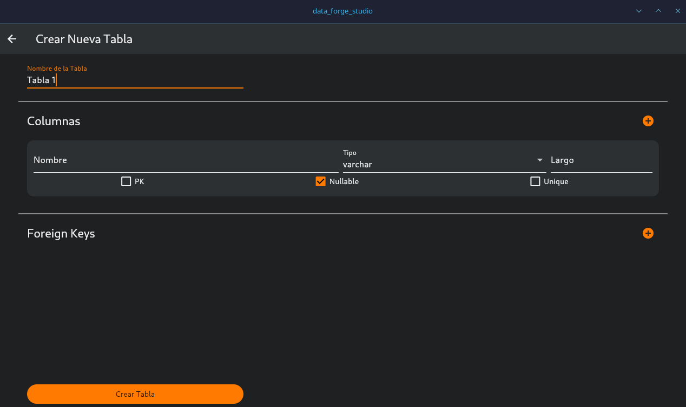
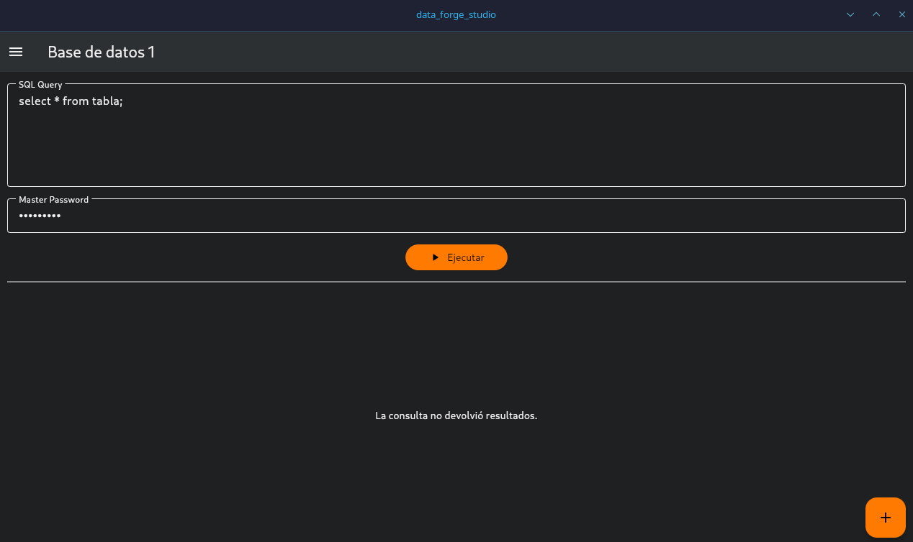
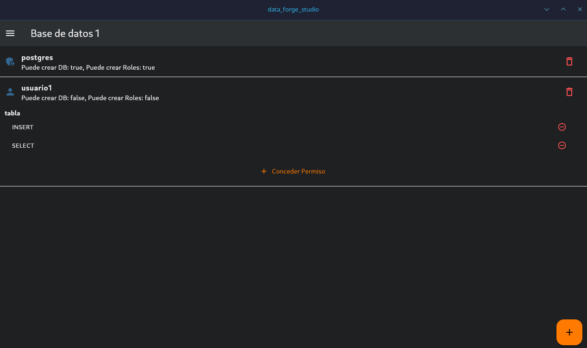

# 🔥 DataForge

> *Forja tus bases de datos locales con el poder de Docker*

[](LICENSE)
[](https://www.oracle.com/java/)
[](https://spring.io/projects/spring-boot)
[](https://flutter.dev)
[](https://www.docker.com/)


**Un administrador de bases de datos local poderoso, seguro y fácil de usar**

[📥 Descargar](#-instalación) • [📚 Documentación](#-funcionalidades-principales) • [🛠️ Desarrollo](#-desarrollo) • [🐛 Reportar Issue](https://github.com/tu-usuario/dataforge/issues)

---

## 🔥 ¿Qué es DataForge?

**DataForge** es una aplicación de escritorio que combina la potencia de **Docker** con una interfaz intuitiva para gestionar bases de datos locales. Forja, moldea y gestiona tus contenedores de bases de datos con la precisión de un maestro herrero.

### ✨ Características Destacadas

**🐳 Gestión Docker Integrada**
- Crea contenedores de bases de datos al instante
- Soporte para MySQL, PostgreSQL, MongoDB y más
- Control total desde una interfaz gráfica

**🔒 Seguro y Local**
- Todo corre en tu máquina
- Sin exposición a internet
- Datos persistentes y seguros

**⚡ Rendimiento Optimizado**
- Backend Spring Boot eficiente
- Puerto dinámico automático
- Base de datos H2 embebida

**🎨 Interfaz Moderna**
- Desarrollada en Flutter
- Diseño intuitivo y responsivo
- Tema de forja con colores azul y naranja

---

## 📥 Instalación

DataForge se distribuye como un **AppImage** autocontenido. No requiere instalación compleja ni dependencias adicionales.

### 🔧 Requisitos Previos

- ✅ Linux (x86_64)
- ✅ Docker instalado y en ejecución
- ✅ Permisos para ejecutar Docker (usuario en grupo `docker`)

### 📦 Descarga e Instalación

#### 1️⃣ **Descargar el AppImage**

Descarga la última versión desde [Releases](https://github.com/JorgeFaa/dataforge/releases):

```
DataForge-x86_64.AppImage
```

#### 2️⃣ **Dar permisos de ejecución**

```bash
chmod +x DataForge-x86_64.AppImage
```

#### 3️⃣ **Ejecutar DataForge**

**Opción A:** Doble clic sobre el archivo

**Opción B:** Desde terminal

```bash
./DataForge-x86_64.AppImage
```

> 💡 **Tip:** Puedes mover el AppImage a `~/.local/bin/` o `/usr/local/bin/` para ejecutarlo desde cualquier lugar.

---

## 🗂️ Ubicación de Datos

DataForge crea automáticamente su estructura de datos en:

```
~/.local/share/DataForge/
├── database/          # Base de datos H2 (metadatos)
├── logs/              # Logs del sistema
├── docker-configs/    # Configuraciones de contenedores
└── backups/           # Respaldos automáticos
```

**🔒 Tus datos permanecen seguros** incluso después de cerrar la aplicación.

---

## 🎯 Funcionalidades Principales

### 🐳 Gestión de Contenedores Docker

#### 🔹 Crear Contenedores de Bases de Datos

DataForge te permite crear contenedores Docker con un solo clic:

- **MySQL** (5.7, 8.0)
- **PostgreSQL** (12, 13, 14, 15, 16)
- **MongoDB** (4, 5, 6, 7)
- **Redis**
- **MariaDB**
- Y más...

**Características:**
- Configuración automática de puertos
- Volúmenes persistentes
- Variables de entorno personalizables
- Redes Docker aisladas

#### 🔹 Administrar Contenedores Existentes

- ▶️ Iniciar/Detener contenedores
- 🔄 Reiniciar servicios
- 🗑️ Eliminar contenedores
- 📊 Monitorear estado y logs en tiempo real
- 💾 Ver uso de recursos (CPU, RAM, almacenamiento)

#### 🔹 Conexiones de Base de Datos

- 🔌 Prueba de conexiones integrada
- 📋 Información de conexión copiable
- 🔑 Gestión de credenciales
- 🌐 Exportar configuraciones para herramientas externas

### 📊 Panel de Control

```
┌─────────────────────────────────────────────────────┐
│  🔥 DataForge - Panel de Control                   │
├─────────────────────────────────────────────────────┤
│                                                     │
│  📦 Contenedores Activos: 3                        │
│  💾 Bases de Datos: 5                              │
│  🔧 Docker Status: ✅ Running                       │
│                                                     │
│  ┌─────────────┬──────────┬─────────┬──────────┐  │
│  │   Nombre    │   Tipo   │ Estado  │ Puerto   │  │
│  ├─────────────┼──────────┼─────────┼──────────┤  │
│  │  dev-mysql  │  MySQL   │ Running │  3306    │  │
│  │  prod-pg    │ Postgres │ Running │  5432    │  │
│  │  cache-rds  │  Redis   │ Running │  6379    │  │
│  └─────────────┴──────────┴─────────┴──────────┘  │
│                                                     │
└─────────────────────────────────────────────────────┘
```

### 🔒 Seguridad y Privacidad

- ✅ **Ejecución 100% local** - No requiere internet
- ✅ **Sin telemetría** - Tus datos son solo tuyos
- ✅ **Puerto dinámico** - Evita conflictos automáticamente
- ✅ **Contenedores aislados** - Redes Docker separadas
- ✅ **Credenciales seguras** - Almacenamiento encriptado

### 📝 Logs y Diagnóstico

Los logs del sistema se guardan en:

```
~/.local/share/DataForge/logs/
├── backend.log         # Logs del backend Spring Boot
├── docker.log          # Interacciones con Docker
└── application.log     # Log general de la aplicación
```

En caso de errores, estos archivos te ayudarán a diagnosticar problemas.

---

## 🏗️ Arquitectura

```
┌─────────────────────────────────────────────────────────┐
│                    DataForge AppImage                    │
├─────────────────────────────────────────────────────────┤
│                                                          │
│  ┌────────────────────┐         ┌──────────────────┐   │
│  │  Frontend (Flutter) │ ◄─────► │ Backend (Spring) │   │
│  │                     │  REST   │                  │   │
│  │  - UI/UX           │  API    │  - Lógica        │   │
│  │  - Controles       │         │  - Docker SDK    │   │
│  │  - Monitoreo       │         │  - Base de Datos │   │
│  └────────────────────┘         └──────────────────┘   │
│           ▲                              │              │
│           │                              ▼              │
│           │                     ┌─────────────────┐    │
│           │                     │   H2 Database   │    │
│           │                     │   (Metadatos)   │    │
│           │                     └─────────────────┘    │
│           │                              │              │
│           │                              ▼              │
│           │                     ┌─────────────────┐    │
│           └─────────────────────┤  Docker Engine  │    │
│                                 │                 │    │
│                                 │  🐳 Contenedores│    │
│                                 └─────────────────┘    │
│                                                          │
└─────────────────────────────────────────────────────────┘
```

### 🔄 Flujo de Inicio

1. 🚀 **AppImage ejecutado** por el usuario
2. 🔧 **AppRun script** crea estructura de datos
3. ☕ **Backend Spring Boot** inicia con JRE embebida
4. 🔌 **Puerto dinámico** detectado y exportado
5. 💾 **Base de datos H2** creada/conectada
6. 🐳 **Docker daemon** verificado
7. 🎨 **Frontend Flutter** lanzado con API_PORT
8. ✅ **Aplicación lista** para usar

---

## 🛠️ Desarrollo

### 🔧 Stack Tecnológico

#### Backend
- **Java 21** - Lenguaje principal
- **Spring Boot 3** - Framework
- **Spring Data JPA** - Persistencia
- **H2 Database** - Base de datos embebida
- **Docker Java SDK** - Integración con Docker
- **Lombok** - Reducción de boilerplate

#### Frontend
- **Flutter** - Framework UI
- **Linux Desktop** - Target platform
- **HTTP** - Comunicación con API REST
- **Provider** - Gestión de estado

### 📂 Estructura del Proyecto

```
DataForge/
├── backend/                    # Spring Boot application
│   ├── src/
│   │   ├── main/
│   │   │   ├── java/
│   │   │   │   └── com/dataforge/
│   │   │   │       ├── controller/
│   │   │   │       ├── service/
│   │   │   │       ├── repository/
│   │   │   │       ├── model/
│   │   │   │       └── config/
│   │   │   └── resources/
│   │   │       └── application.properties
│   │   └── test/
│   ├── pom.xml
│   └── mvnw
│
├── frontend/                   # Flutter application
│   ├── lib/
│   │   ├── screens/
│   │   ├── widgets/
│   │   ├── services/
│   │   ├── models/
│   │   └── main.dart
│   ├── pubspec.yaml
│   └── build/
│
├── packaging/                  # AppImage packaging
│   ├── AppRun                 # Startup script
│   ├── dataforge.desktop      # Desktop entry
│   ├── icon.png               # Application icon
│   └── build_appimage.sh      # Build script
│
├── docs/                       # Documentation
│   ├── API.md
│   ├── CONTRIBUTING.md
│   └── ARCHITECTURE.md
│
├── assets/                     # Resources
│   ├── logo.png
│   └── screenshots/
│
├── README.md
├── LICENSE
└── .gitignore
```

### 🔨 Compilación Manual

#### 1️⃣ Compilar Backend

```bash
cd backend
./mvnw clean package -DskipTests
```

El JAR se genera en: `backend/target/dataforge-backend.jar`

#### 2️⃣ Compilar Frontend

```bash
cd frontend
flutter pub get
flutter build linux --release
```

El bundle se genera en: `frontend/build/linux/x64/release/bundle/`

#### 3️⃣ Generar AppImage

```bash
cd packaging
./build_appimage.sh
```

Este script:
- ✅ Compila backend y frontend
- ✅ Descarga JRE embebida (si no existe)
- ✅ Crea estructura AppDir
- ✅ Genera `DataForge-x86_64.AppImage`

### 🧪 Tests

```bash
# Backend tests
cd backend
./mvnw test

# Frontend tests
cd frontend
flutter test
```

### 🐛 Debugging

Para ejecutar en modo desarrollo:

```bash
# Backend (puerto 8080)
cd backend
./mvnw spring-boot:run

# Frontend (en otra terminal)
cd frontend
export API_PORT=8080
flutter run -d linux
```

---

## 🤝 Contribuir

¡Las contribuciones son bienvenidas! Por favor lee [CONTRIBUTING.md](docs/CONTRIBUTING.md) para conocer el proceso.

### 🔥 Pasos para Contribuir

1. 🍴 Fork el proyecto
2. 🌿 Crea una rama (`git checkout -b feature/AmazingFeature`)
3. 💾 Commit tus cambios (`git commit -m 'Add some AmazingFeature'`)
4. 📤 Push a la rama (`git push origin feature/AmazingFeature`)
5. 🎯 Abre un Pull Request

---

## 📊 Roadmap

- [x] Gestión básica de contenedores Docker
- [x] Interfaz gráfica con Flutter
- [x] Distribución como AppImage
- [ ] Soporte para Docker Compose
- [ ] Respaldos automáticos programados
- [ ] Importar/Exportar configuraciones
- [ ] Gestión de volúmenes Docker
- [ ] Soporte para Windows y macOS
- [ ] Terminal integrada
- [ ] Monitoreo de métricas en tiempo real

---

## 📸 Capturas de Pantalla

### Panel Principal


### Creacion de tablas


### Funcion Query


### Admistración de usuarios


---

## 📄 Licencia

Este proyecto está licenciado bajo la **MIT License** - consulta el archivo [LICENSE](LICENSE) para más detalles.

```
MIT License

Copyright (c) 2024 Jorge Francisco Acosta Alcalá

Permission is hereby granted, free of charge, to any person obtaining a copy
of this software and associated documentation files (the "Software")...
```

---

## 👨‍💻 Autor

**Jorge Francisco Acosta Alcalá**

[](https://github.com/JorgeFaa)
[](https://www.linkedin.com/in/jorge-francisco-acosta-alcal%C3%A1-574986365/)
[](mailto:jorgefranciscoacostaa@gmail.com)

---

## ❓ FAQ

**¿Necesito instalar Docker por separado?**

Sí, DataForge requiere que Docker esté instalado y en ejecución en tu sistema. La aplicación se conecta al daemon de Docker para gestionar contenedores.

**¿Puedo usar DataForge sin conexión a internet?**

Sí, DataForge funciona 100% offline. Solo necesitas internet si quieres descargar nuevas imágenes de Docker.

**¿Dónde se guardan las bases de datos?**

Los contenedores Docker crean volúmenes persistentes gestionados por Docker. Los metadatos de DataForge se guardan en `~/.local/share/DataForge/`.

**¿Cómo actualizo DataForge?**

Simplemente descarga el nuevo AppImage y reemplaza el anterior. Tus datos se mantienen en `~/.local/share/DataForge/`.

**¿Funciona en otras distribuciones de Linux?**

Sí, el AppImage es compatible con la mayoría de distribuciones Linux modernas (Ubuntu, Fedora, Arch, Debian, etc.).

---

## 🔥 Forja tus bases de datos con DataForge 🔥

**Si este proyecto te resulta útil, considera darle una ⭐**

---

*Hecho con 🧡 y ☕ por Jorge Francisco Acosta Alcalá*
